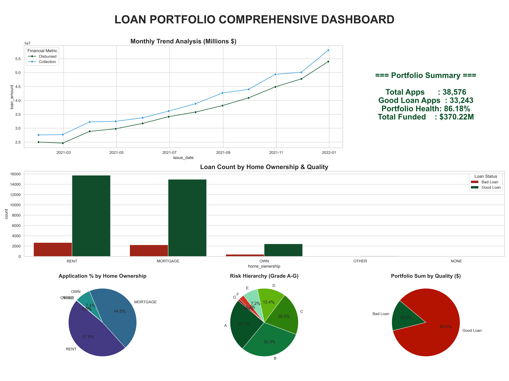
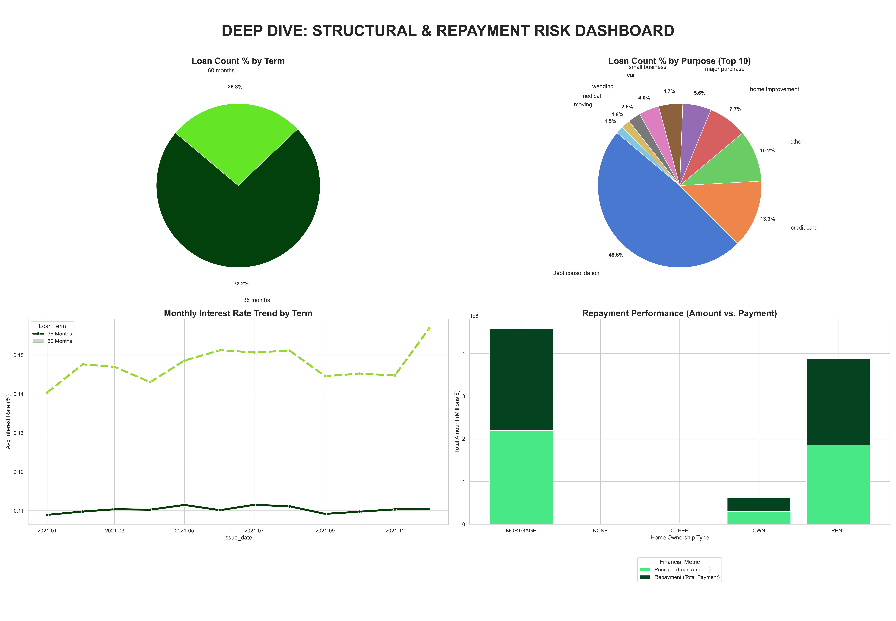

# Loan-Portfolio-Risk-Analytics
This project provides a comprehensive data-driven analysis of a loan portfolio containing over 38,000 applications. The primary objective was to evaluate portfolio health, identify risk hierarchies across different demographics, and visualize repayment performance using Python.

#Dataset Summary
This project analyzes a lending dataset to evaluate credit risk and portfolio health. The data covers **$370.22M** in total disbursements, primarily driven by **Debt Consolidation (48.6%)** and **Credit Card (13.3%)** loans. By segmenting borrowers by home ownership and a **13.33% average DTI**, the analysis identifies key risk hierarchies across loan grades A–G. 
The portfolio maintains a robust **86.18% success rate**, with "Good Loans" generating **$473.07M** in total repayments. These insights provide a professional look at monthly interest trends and the correlation between residential stability and repayment reliability.

#Key Visualizations
# 1. Unified Portfolio Summary

*High-level overview of KPIs, monthly disbursement trends, and risk distribution.*

# 2. Structural Risk Deep-Dive

*Analysis of loan purposes, repayment performance, and interest rate trends by term.*

## 🛠️ Tech Stack
Language: Python
Libraries: Pandas, Matplotlib, Seaborn, NumPy
Environment: Jupyter Notebook / VS Code
